<!-- TOC depthFrom:2 orderedList:true -->

- [1. 引言](#1-引言)
- [2. 一次请求的全景图](#2-一次请求的全景图)
- [3. 请求进入 vLLM 之后的第一段路](#3-请求进入-vllm-之后的第一段路)
    - [3.1 Tokenizer：文本进入模型的入口](#31-tokenizer文本进入模型的入口)
    - [3.2 Embedding：token 如何变成向量](#32-embeddingtoken-如何变成向量)
    - [3.3 Q / K / V：注意力计算里的三个角色](#33-q--k--v注意力计算里的三个角色)
    - [3.4 Self-Attention：上下文中的语义汇聚](#34-self-attention上下文中的语义汇聚)
    - [3.5 Prefill：整段 prompt 的首次计算](#35-prefill整段-prompt-的首次计算)
- [4. 模型开始生成时，内部在发生什么](#4-模型开始生成时内部在发生什么)
    - [4.1 Decode：逐 token 推进的生成过程](#41-decode逐-token-推进的生成过程)
    - [4.2 KV Cache：历史信息如何被复用](#42-kv-cache历史信息如何被复用)
    - [4.3 当前 token 与历史 token 的交互方式](#43-当前-token-与历史-token-的交互方式)
- [5. 一个 token 如何真正被选出来](#5-一个-token-如何真正被选出来)
    - [5.1 Hidden State：当前位置的语义结果](#51-hidden-state当前位置的语义结果)
    - [5.2 LM Head：从语义空间到词表空间](#52-lm-head从语义空间到词表空间)
    - [5.3 logits：词表上的原始分数](#53-logits词表上的原始分数)
    - [5.4 top-k / top-p / temperature：采样规则如何工作](#54-top-k--top-p--temperature采样规则如何工作)
- [6. attention score 与 logits 放在一张图里看](#6-attention-score-与-logits-放在一张图里看)
- [7. vLLM 的性能价值落点](#7-vllm-的性能价值落点)
    - [7.1 PagedAttention](#71-pagedattention)
    - [7.2 Block Table 与 KV Block](#72-block-table-与-kv-block)
    - [7.3 Continuous Batching](#73-continuous-batching)
    - [7.4 Prefix Cache](#74-prefix-cache)
- [8. 几个高频疑问](#8-几个高频疑问)
- [9. 总结](#9-总结)

<!-- /TOC -->

# vLLM 推理主线：从一次请求看懂 Attention、KV Cache 与输出生成

## 1. 引言

很多人学大语言模型推理时，会遇到这样一种体验：  
每个词都认识，整条链路放在一起就容易散。

- Self-Attention 看起来懂一点  
- Q / K / V 看起来懂一点  
- KV Cache 也知道和提速有关  
- LM Head、logits、top-k 这些概念单独拿出来也能解释  

到了源码、推理框架或者线上服务，问题就会集中冒出来：

- Query 在查什么  
- KV Cache 里到底放了什么  
- 当前 token 和历史 token 的关系怎么建立  
- logits 和 attention score 各自在哪一步出现  
- LM Head 为什么直接连着输出  
- vLLM 的快，快在模型原理，还是快在工程实现  

这篇文章围绕一条线展开：

> 用户发来一句话之后，vLLM 如何完成输入处理、上下文建模、历史复用，以及下一个 token 的生成。

读完之后，整条链路会形成一个闭环：

```text
用户输入
  ↓
分词
  ↓
向量化
  ↓
多层 Attention 建模
  ↓
建立 KV Cache
  ↓
逐 token 生成
  ↓
LM Head 映射词表
  ↓
logits + 采样
  ↓
输出下一个 token
```

---

## 2. 一次请求的全景图

先把地图立起来，再进入细节。

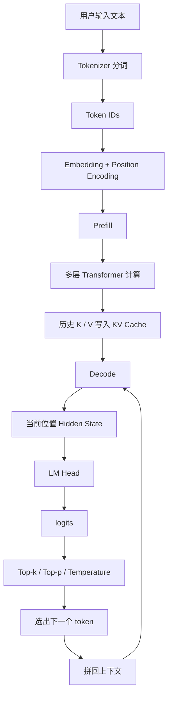

这张图可以拆成三段：

1. **输入阶段**：文本进入模型，形成上下文化语义表示  
2. **生成阶段**：复用历史缓存，逐 token 往前推进  
3. **输出阶段**：当前位置的语义结果映射到词表，选出下一个 token  

---

## 3. 请求进入 vLLM 之后的第一段路

### 3.1 Tokenizer：文本进入模型的入口

用户输入一句话，例如：

```text
介绍一下北京的旅游景点
```

这段文本进入 vLLM 后，第一步是 Tokenizer 分词。  
模型内部处理的基本单位是 token。

中文场景里，token 的粒度和自然语言里的“词”并不严格一致。  
它可能是：

- 一个汉字  
- 两三个汉字组成的片段  
- 标点  
- 特殊符号  

图示如下：

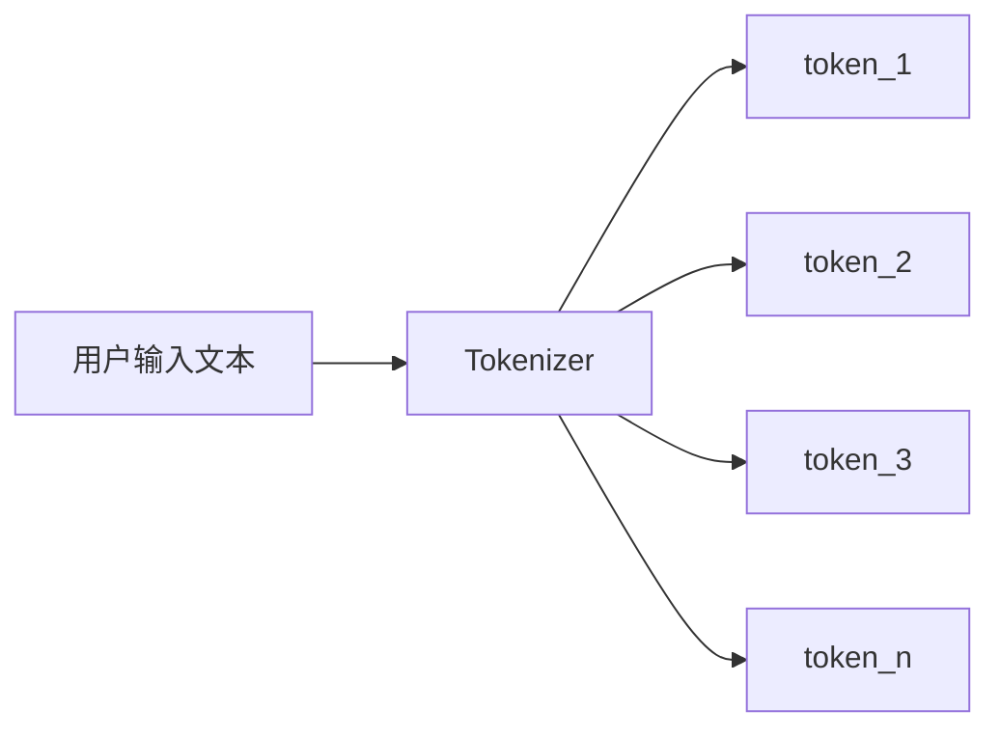

切分结束后，token 会进一步转成 token id：

```text
"介绍一下北京的旅游景点"
↓
[token_1, token_2, token_3, ..., token_n]
↓
[id_1, id_2, id_3, ..., id_n]
```

这里有两个直接影响：

- 输入会被拆成什么粒度  
- 输出阶段每一步有哪些 token 可选  

词表在这一步的作用非常直接：  
它定义了模型处理语言时使用的基本单位。

### 3.2 Embedding：token 如何变成向量

token id 还是离散编号。  
模型真正计算的对象是向量。

每个 token id 会在 embedding table 中找到自己的向量表示。  
同时，还会加上位置信息，告诉模型：

- 这个 token 在序列中的位置  
- 它和前后 token 的相对关系  

图示如下：

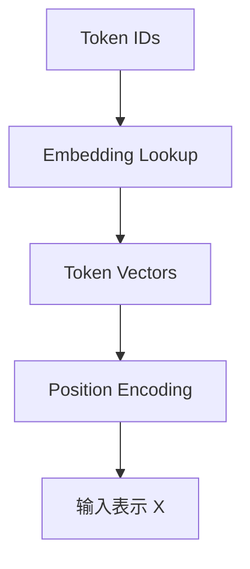

到这里，字符串已经变成一串向量序列。  
Transformer 的后续计算都基于这组向量展开。

### 3.3 Q / K / V：注意力计算里的三个角色

对于某个 token 当前的输入表示 `x`，模型会通过三组参数得到三种投影结果：

```python
Q = x @ W_Q
K = x @ W_K
V = x @ W_V
```

图示如下：

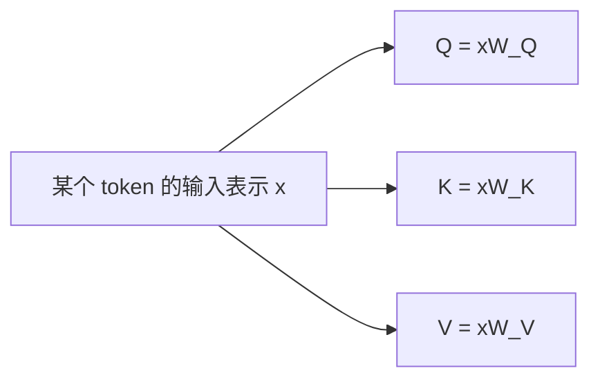

这三个向量在计算中承担着不同角色：

- **Q（Query）**：当前位置带着什么需求去看上下文  
- **K（Key）**：当前位置暴露出哪些特征，方便别的位置与它匹配  
- **V（Value）**：当前位置最终提供给别的位置的内容  

这个设计带来的好处很清楚：  
同一个 token 表示，通过不同投影，可以参与不同职责的计算。

### 3.4 Self-Attention：上下文中的语义汇聚

Self-Attention 决定了每个 token 如何从上下文中吸收信息。

以当前位置 `i` 为例，它会做这样一组动作：

1. 拿自己的 `Q_i`  
2. 和上下文所有位置的 `K_1 ... K_n` 做相关性计算  
3. 得到一组 attention score  
4. 经过 softmax 变成注意力权重  
5. 对上下文中的 `V_1 ... V_n` 做加权求和  
6. 得到当前位置新的表示  

图示如下：

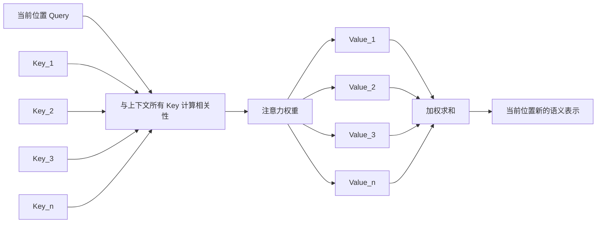

这一阶段完成的是上下文建模。  
当前位置会根据整段上下文，形成更贴合当前语境的表示。

举个非常直观的例子：

```text
苹果今天涨了
我今天买了苹果吃
```

两个句子中都出现了“苹果”，  
经过 attention 之后，它们拿到的上下文信息完全不同，最终表示也会不同。

于是，token 在句子里的含义会被动态塑形。

### 3.5 Prefill：整段 prompt 的首次计算

当用户 prompt 第一次进入模型时，整段上下文会一起参与计算。  
这个阶段叫 **prefill**。

prefill 的工作内容包括：

1. prompt 全量进入 Transformer  
2. 所有已知 token 计算 Q / K / V  
3. 多层 attention 和 FFN 完成整段上下文建模  
4. 各层历史 token 的 K / V 写入缓存  

图示如下：

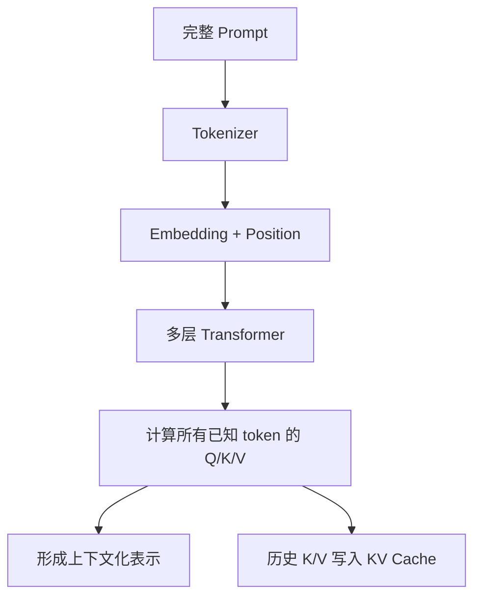

prefill 往往是长上下文场景里成本较高的一段。  
因为它需要处理整段 prompt，而这一段计算还没有可复用的历史缓存可拿。

---

## 4. 模型开始生成时，内部在发生什么

### 4.1 Decode：逐 token 推进的生成过程

prefill 结束后，模型进入 decode 阶段。  
这时生成开始逐 token 推进。

每一步大致如下：

1. 当前上下文已经存在  
2. 新位置计算当前 token 的 Q / K / V  
3. 当前 Query 去读取历史 KV Cache  
4. 得到当前位置的 hidden state  
5. 当前 token 的 K / V 写回缓存  
6. 进入输出阶段  

图示如下：

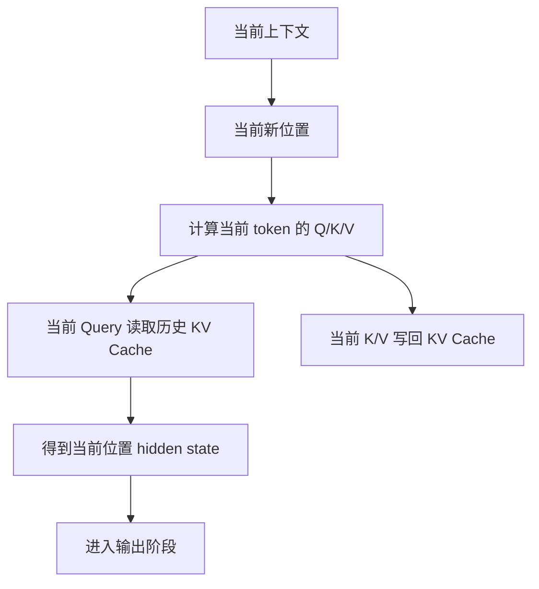

decode 过程中，模型每一步都只做增量推进。  
上下文越长，KV Cache 的价值越明显。

### 4.2 KV Cache：历史信息如何被复用

KV Cache 存的是历史 token 在各层中的 Key 和 Value。  
这样一来，生成新 token 时，历史部分无需重新计算。

图示如下：

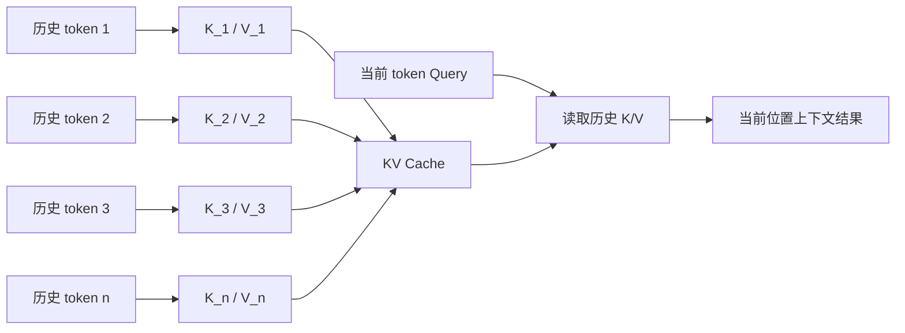

这套机制决定了生成阶段的性能上限。  
历史 token 的 K / V 已经在缓存里，当前步只需要为新增 token 计算对应部分。

这一点和“重新处理整段 prompt”之间的差异，会直接转化为速度差异。

### 4.3 当前 token 与历史 token 的交互方式

当前 token 与历史 token 的交互可以写成：

```python
attention_scores = Q_t @ K_cache.T
attention_weights = softmax(attention_scores)
context = attention_weights @ V_cache
```

这里有三个关键点：

1. Query 来自当前新位置  
2. Key / Value 来自历史缓存  
3. attention score 对应的是“上下文位置”的打分  

这一步完成后，当前位置的上下文结果才会形成，随后再进入下一层或进入输出映射。

---

## 5. 一个 token 如何真正被选出来

### 5.1 Hidden State：当前位置的语义结果

当前位置经过多层 Transformer 计算后，会得到一个最终 hidden state。  
它是当前位置在当前上下文下的语义浓缩结果。

可以把它理解为：

> 模型对当前位置的综合判断结果

这个向量已经包含了：

- 当前上下文的主题  
- 历史 token 的依赖关系  
- 当前生成阶段的语义重心  

### 5.2 LM Head：从语义空间到词表空间

LM Head 对应模型的输出层。  
它负责把当前位置的 hidden state 映射到整个词表。

一般写法如下：

```python
logits = h_t @ W_vocab
```

其中：

- `h_t`：当前位置 hidden state  
- `W_vocab`：映射到整个词表空间的参数矩阵  
- `logits`：词表维度上的原始分数  

图示如下：

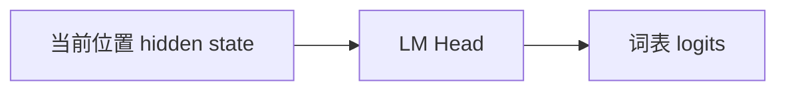

LM Head 接住的是语义空间里的结果，输出的是词表空间里的分数。  
这一步把“当前位置想表达什么”翻译成“词表里的哪些 token 分数更高”。

### 5.3 logits：词表上的原始分数

logits 对应的是整个词表上的原始打分。  
假设词表大小是 100000，那么当前位置会得到长度为 100000 的分数向量。

示意如下：

```text
hidden state
   ↓
LM Head
   ↓
[
  token_1: score_1,
  token_2: score_2,
  token_3: score_3,
  ...
  token_n: score_n
]
```

这些分数表示当前位置输出各个候选 token 的倾向程度。

例如在“介绍一下北京的旅游___”这个上下文下：

- “景点”可能分数更高  
- “历史”可能也有一定分数  
- 标点、终止符等也会参与竞争  

### 5.4 top-k / top-p / temperature：采样规则如何工作

logits 进入采样阶段后，常见的控制参数包括：

- **temperature**：调节分布的平滑程度  
- **top-k**：保留分数最高的 k 个候选  
- **top-p**：保留累计概率达到阈值 p 的候选集合  

流程图如下：

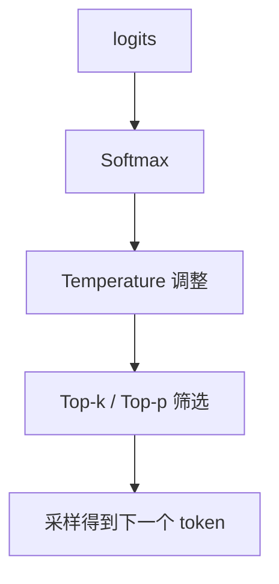

采样结束后，真正输出的 token 会拼接到当前上下文末尾。  
接下来继续进入下一轮 decode。

---

## 6. attention score 与 logits 放在一张图里看

这两个概念最容易混。

它们出现的位置不同，打分对象也不同。

### attention score

- 出现在 Self-Attention 阶段  
- 打分对象是历史上下文位置  
- 解决的是当前 token 该关注哪些历史 token  

### logits

- 出现在 LM Head 之后  
- 打分对象是整个词表候选 token  
- 解决的是当前位置输出哪个 token  

放到一张图里：

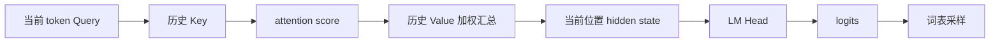

一条更直观的理解路径是：

- attention score 负责“看谁”  
- logits 负责“选谁”  

---

## 7. vLLM 的性能价值落点

Transformer 的基础计算流程在各类实现里是共通的。  
vLLM 的优势主要体现在推理工程层。

### 7.1 PagedAttention

vLLM 将 KV Cache 拆成固定大小的 block，以分页方式管理显存中的缓存内容。  
这让缓存的分配、扩容、回收都更灵活。

图示如下：

```text
逻辑序列位置
   ↓
Block Table
   ↓
KV Blocks
   ↓
物理显存块
```

在长上下文和多请求并发场景里，这种布局能明显减轻显存碎片问题。

### 7.2 Block Table 与 KV Block

每个序列会维护一张 block table。  
这张表负责描述：

- 逻辑上的上下文位置  
- 物理上的 KV block 映射关系  

这让同一个请求的缓存可以按块组织，随着生成过程动态增长。  
多个请求并发时，块的回收与复用也更容易调度。

### 7.3 Continuous Batching

vLLM 支持连续批处理。  
请求可以动态进入批次，也可以动态退出批次。

这对线上服务很关键：

- GPU 利用率更高  
- 等待时间更短  
- 不同长度请求能够更自然地混跑  

Continuous Batching 和 KV Cache 管理放在一起看，才能看清 vLLM 的吞吐优势从哪里来。

### 7.4 Prefix Cache

许多请求拥有共同前缀。  
聊天场景、带系统提示词的应用、多轮对话场景都很常见。

前缀复用能直接节省 prefill 成本。  
这一点在重复模板、重复系统提示、重复历史上下文的业务场景里很有价值。

---

## 8. 几个高频疑问

### 8.1 KV Cache 存的是词表信息吗

KV Cache 存的是当前请求历史 token 的 K / V。  
缓存对象属于上下文序列空间。

### 8.2 Query 没有命中缓存时会发生什么

模型会对当前请求中实际出现的 prompt token 做 prefill，建立对应的 K / V。  
计算范围仍然属于当前序列中的 token。

### 8.3 需要对整个词表计算 K / V 吗

不需要。  
词表参与的是 LM Head 和 logits 采样阶段。  
K / V 的计算对象属于当前序列里的 token 表示。

### 8.4 top-k 筛选的是历史 token 吗

top-k 作用在词表采样阶段。  
筛选对象是词表候选 token。

### 8.5 LM Head 和 Self-Attention 的关系怎么理解

Self-Attention 完成上下文建模，形成当前位置的 hidden state。  
LM Head 接过这个结果，把它映射到整个词表。

---

## 9. 总结

从一次请求的完整生命周期来看，vLLM 中的推理主线可以归纳成下面这张图：

```text
用户输入
  ↓
Tokenizer 分词
  ↓
Embedding + Position Encoding
  ↓
Prefill：整段 prompt 建立上下文表示
  ↓
历史 K/V 写入 KV Cache
  ↓
Decode：逐 token 生成
  ↓
当前位置 hidden state
  ↓
LM Head
  ↓
logits
  ↓
top-k / top-p / temperature
  ↓
下一个 token
  ↓
拼回上下文继续生成
```

把这条线打通之后，几个核心概念会自然落位：

- **Q / K / V**：注意力计算里的三种角色  
- **Self-Attention**：上下文建模的核心机制  
- **Prefill**：整段 prompt 的首次计算  
- **KV Cache**：历史 K / V 的复用机制  
- **Decode**：逐 token 推进的生成过程  
- **LM Head**：从 hidden state 映射到整个词表  
- **logits**：词表上的原始分数  
- **top-k / top-p**：从词表候选中完成采样筛选  

站在工程实现角度看，vLLM 的价值集中在：

- 更高效的 KV Cache 管理  
- 更灵活的显存分页方式  
- 更强的批处理调度能力  
- 更好的在线推理吞吐表现  

整条链路清楚之后，再去看 vLLM 的调度器、block manager、paged attention kernel、cache manager，主干会非常清晰。
